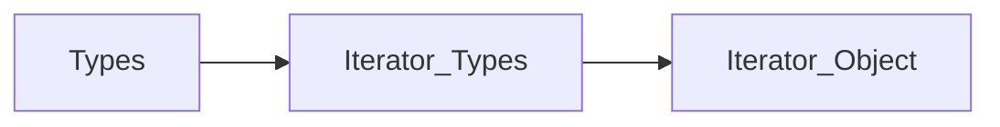

## C++ Review

Based on *C++ Primer* and *CS106L*


### Types and Variable


#### Outline

**types basics** + **variable declaration** + **casting**


#### Type Basics

- Unsigned type: **integral** type
  1. In an unsigned type, **all the bits represent the value.** For example, an 8-bit unsigned char can hold the values from 0 through 255 (i.e. 2^8) inclusive. Note: unsigned type **never overflows** since it **wraps around ** by modulo of the length of the range. For example, an 8-bit unsigned char's value will mod 256 if it overflows.
  2. **Never mix unsigned type with signed types**.
  3. Be careful when trying to **subtract** from an unsigned value! For example, infinite for loop bug when subtracting from unsigned index
- Advice

​	1. Use an unsigned type when you know that the values cannot be negative.

​	2. Avoid undefined AND  implementation-defined behavior.

​	3. Define variables where you FIRST use them.

Implementation-defined behavior:

> Similarly, programs usually should avoid implementation-defined behavior, such as assuming that the size of an int is a fixed and known value. Such programs are said to be nonportable. When the program is moved to another machine, code that relied on implementation-defined behavior may fail. Tracking down these sorts of problems in previously working programs is, mildly put, unpleasant.

- **The `decltype` Type Specifier**

  - Use: 

  > Sometimes we want to define a variable with a type that the compiler deduces **from an expression** but **do not want to use that expression** to initialize the variable. For such cases, the new standard introduced a second type specifier, `decltype`, which returns the type of its operand.
  >
  > Note: When the expression to which we apply decltype is a variable, decltype returns the type of that variable, **including top-level const and references**

  - Difference with `auto`: 
    - **Key:** `decltype` does not evaluate the given expression and initialize the variable; `auto` initialize the variable with the value
    - Top-level const and reference
  - Examples:

  ```c++
  const int a = 10;
  decltype(a) b = 100; // preserve the top-level const of a, which is const int
  int k;
  decltype(k = 10) c; // warning: Expression with side effects has no effect in an unevaluated context(i.e. the k = 10 expression is not evaluated)
  ```

  **Combine `decltype` with templates: use it to fill type parameters**

  ```c++
  std::vector<int> v {1, 2, 3, 4};
  my_util::printContainer<decltype(v.begin()), decltype(v.front())>(cout, v.begin(), v.end());
  
  // priority_queue
  auto cmp = [](const auto& v1, const auto& v2) {return v1.size() < v2.size();};
  std::priority_queue<vector<int>, vector<vector<int>>, decltype(cmp)> q(cmp); // decltype(cmp) only give the type not the value of the expression to the type parameter, must use cmp to init the comparator
  ```

  

  


#### Casting: implicit + explicit

- Implicit cast: convert to **wider** type.

  - Arithmetic conversion: promotion -> signedness -> (same: wider); (otherwise: diff sign)

    Diff sign:

    - If unsigned type is **semantically** >= signed type: convert to unsigned type. For example, `int` and `unsigned int` when mixed together, `int` convert to the `unsigned int` since the size of `int` and `unsigned int` are "semantically" equal.
    - Otherwise: depend on machines: if signed type is **really (i.e. have more bits on the machine)** larger than the signed type, convert unsigned type to signed type; otherwise, convert to unsigned type. 

  - Array to Pointer Conversions

  - Conversions to bool

  - Conversion to const

  - Conversions Defined by Class Types

- Explicit cast: 

  - `static_cast<type>()`: type conversion

  > 1. A static_cast is often useful when a larger arithmetic type is assigned to a smaller type. The cast informs both the reader of the program and the compiler that we are aware of and are not concerned about the potential loss of precision.
  >
  > 2. A static_cast is also useful to perform a conversion that the compiler will not generate automatically.

  - `const_cast`: cast away const

  > 1. A const_cast changes only a low-level (§ 2.4.3, p. 63) const in its operand
  >
  > 2. Only a const_cast may be used to change the constness of an expression. Trying to change whether an expression is const with any of the other forms of named cast is a compile-time error. Similarly, we cannot use a const_cast to change the type of an expression
  >
  > 3. A const_cast is most useful in the context of overloaded functions, which we’ll describe in § 6.4 (p. 232).

  ​	Use of `const_cast` with `static_cast`:

  ```c++
  template<typename T>
  typename MyVector<T>::const_reference MyVector<T>::at(sizt_type pos) const {
  	return _ele[pos];
  }
  
  template<typename T>
  typename MyVector<T>::reference MyVector<T>::at(size_type pos) {
      // add low-level const with static_cast then cast const away with const_cast
  	return const_cast<reference>(static_cast<const MyVector<T>*>(this)->at(pos));
  }
  ```
  
  
  
  
  
  - `reinterpret_cast`: dangerous, don't use!
  
  > A reinterpret_cast generally performs a low-level reinterpretation of the bit pattern of its operands.
  
  - `dynamic_cast`: run-time type conversion, used in polymorphism.
  
    - Error handling
  
    > If the cast fails and *target-type* is a **pointer type**, it returns a **null pointer** of that type. If the cast fails and *target-type* is a **reference type**, it **throws an exception** that matches a handler of type [std::bad_cast](https://en.cppreference.com/w/cpp/types/bad_cast).


#### Variable Declaration

- Declaration and Definition:

  - Why declaration and definition are separated? To support separate compilation.

  - A **declaration** makes a name known to the program. A file that wants to use <u>a name defined elsewhere</u> **includes a declaration for that name.**

  - A **definition** creates the associated entity.

  - Any declaration that includes an **explicit initializer is a definition.**

  - Variables must be **defined exactly once** but can be **declared many times.**

  - `extern` keyword: declare but not define a variable

    - We can provide an initializer on a variable defined as `extern`, but doing so overrides the extern. An extern that has an initializer is a definition:

    ```c++
    extern const double PI = 3.14; // can only be done outside an function
    ```

    - It is an error to provide an initializer on an extern inside a function.

    ```c++
    int main() {
    	extern const double PI = 3.14; // error
    	return 0;
    }
    ```

    - Example: use `PI` in multiple files

    Define `PI` in `my_util.h`

    ```c++
    extern const double PI = 3.14;
    ```

    Declare `PI` in `main.cpp`

    ```c++
    #include "my_util.h"
    int main() {
    	extern const double PI; // compiler go to extern files to find the symbol PI
    	cout << PI << endl; // 3.14
    }
    ```

    

- Compound type: 
  - Reference: an **alias** of an object
  - Do not return **a reference binding to a local object**!


> It can be easier to understand complicated pointer or reference declarations if you **read them from right to left.**

- Const correctness:

  - Low-level const:ptr to const / ref to const, **only for compound type**! base type const!

  > It may be helpful to think of pointers and references to const as pointers or references that **think** they point or refer to const.” "think": there is no guarantee that the object won't change

  - Top-level const: for any object type itself!
  - Example:
  
  ```c++
  const int b = 10;// top-level
  int a = 100;
  const int &c_ref = a; // low-level
  a++ // low-level const changes for c_ref!
  ```
  
- `auto`: auto can be seen as base type

  1. First, as we’ve seen, when we use **a reference**, we are **really using the object to which the reference refers.**

  ```c++
  int a = 10;
  const int &ref = a;
  auto b = ref // since ref is an alias of a, ref can be replaced with a; type of b is int
  ```
  
  2. Second, auto ordinarily ignores top-level const
  
  ```c++
  const int a = 10;
  auto b = a; // top-level const for a is ignored, type of b is int
  ```
  
  3. `auto &`: When we ask for a reference to an auto-deduced type, top-level consts in the initializer are not ignored.
  
  ```c++
  const int a = 10;
  auto &c_ref = a; //when add & after auto, it considers const correctness, top-level const of a is not ignored, i.e. the type of c_ref is const int &  
  ```
  
  4. Adding `const` before `auto` can be seen as adding top-level const
  
- Type alias: synonym of a **base type**!

  - **Wrong idea**: It can be tempting, albeit incorrect, to interpret a declaration that uses a type alias by **conceptually replacing** the alias with its corresponding type.

  ```c++
  using int_ptr = int *;
  int a = 10
  const int_ptr c_ptr = &a; // wrong: simply replacing int_ptr with int *, i.e. const int * c_ptr: c_ptr is a ptr to const(a.k.a ptr_c); correct: const says that the object int_ptr(int *) is a const, namely, a const ptr!
  *a++;
  ```


### Streams

See more information in `stream_summary.pdf`

#### File Streams

file reading: **inheritance** from cin and cout; They are very similar
When init a fstream `ifstream s("file name")` , **open it automatically**, when destroyed, **close automatically (CADRE)**

Note:

Streams **are not copyable**!


### STL

**Containers(adaptors) + Iterators(adaptors) + Functors(lambda) + Algorithms** 


#### Containers

- Sequence containers: vector and deque: choose which container to use:

  - Vector should be used **by default**. However, deque should be chosen if most insertions and deletions happen **at the beginning or at the end**. For example, using deque to build stack and queue is better than vector. 
  - Container adaptor: stack and queue

  ```c++
  template<
      class T,
      class Container = std::deque<T> // stack is adapted from deque by default
  > class stack;
  ```

  > The `std::stack` class is a **container adaptor** that gives the programmer the functionality of a stack - specifically, a LIFO (last-in, first-out) data structure.

```c++
template<
    class T,
    class Container = std::deque<T>
> class queue;
```

> The `std::queue` class is a **container adaptor** that gives the programmer the functionality of a queue - specifically, a FIFO (first-in, first-out) data structure.


- Associative containers: 

  - `std::remove`: It doesn't work for associative containers!

  > These algorithms cannot be used with associative containers such as [std::set](https://en.cppreference.com/w/cpp/container/set) and [std::map](https://en.cppreference.com/w/cpp/container/map) **because their iterator types do not dereference to [*MoveAssignable*](https://en.cppreference.com/w/cpp/named_req/MoveAssignable) types** (the keys in these containers are not modifiable).

  C++20 update for deleting element: add `std::erase` and `std::erase_if` for all containers, similar to use `std::remove` followed by calling container's `erase` **member function**

  > A call to `remove` is typically followed by <u>a call to a **container's `erase` member function**,</u> which erases the unspecified values and reduces the *physical* size of the container to match its new *logical* size. These two invocations together constitute a so-called [*Erase–remove* idiom](https://en.wikipedia.org/wiki/Erase-remove_idiom), which can be achieved by the free function [std::erase](https://en.cppreference.com/w/cpp/container/vector/erase2) that has [overloads](https://en.cppreference.com/w/cpp/container#Non-member_function_table) for all standard *sequence* containers, or [std::erase_if](https://en.cppreference.com/w/cpp/container/vector/erase2) that has [overloads](https://en.cppreference.com/w/cpp/container#Non-member_function_table) for *all* standard containers (since C++20).

  - Map iterator: the iterator of map points to `std::pair<key_t, val_t>`

  A useful way to to iterate over a map: binding

  ```c++
  for (auto [key, val] : map) {}
  auto [key, val] = map.begin()
  ```

  - For map, `.at()` and `[]` are different:
    - `.at()` will check boundary and it's a `const` function
    - `[]` won't check boundary and it is not `const` function

- Remove element in containers: **erase-remove idiom**

  - Understand `std::remove`:

  > 1. Removes all elements satisfying specific criteria from the range [`first`, `last`) and **returns a past-the-end iterator for the new end of the range.**
  >
  > 2. Removing is done by **shifting** the elements in the range in such a way that the elements that are not to be removed appear in the beginning of the range. 

  Summary: `std::remove` **does not shrink** the size of the container, it just **move the undeleted elements forward**, and return the past-the-end iterator of the new range of the undeleted elements.

  - Note: `std::erae(std::remove(v.begin(), v.end(), num), v.end)`*

    *many containers will define their **own erase** function which does this for you - this only applies if you use the STL erase/remove algorithms

  - Example:

```c++
vector<int> v {1, 2, 3, 4, 3, 7, 3, 3, 8, 10};
v.erase(std::remove_if(v.begin(), v.end(), pred), v.end()); // don't forget the v.end() iter, erase the trash range!
```

#### Iterator

- Types of iterators:
  - Input iterator: **Read only** iterator
  - Output iterator: **Write only** iterator
  - Forward iterator
  - Bidirectional iterator
  - Random access iterator
- **Const correctness about iterator**: `iterator` and `const_iterator`
  
  - Def: `iterator` can both read and write the element it denotes; `const_iterator ` can only read the element it denotes
  - Understanding the naming rule of `const_iterator`,  `const_reference` and `const_ptr`: the `const` key word should be seen as a *qualifier* (i.e. low-level const), which is similar to:
  
  ```c++
  const type* ptr_c;
  const type& ref_c;
  ```
  
  - `begin` and `end` operation: construct iterator and return it
    - For const container: the return value of `begin` and `end` is `const_iterator`
    - `begin` and `end` can be an **iterator tag** for a class and therefore can be applied to stl functions by calling its iterator (see more in *iterator class*)
  - `cbegin` and `cend` in *C++11*: when we only want to read element in a non-const container, we should use `const_iterator` by explicitly calling `cbegin` and `cend`
- Terminology: **Iterator** and **Iterator Types**

> The term iterator is used to refer to **three different entities**. We might mean the **concept** of an iterator, or we might refer to the **iterator type defined by a container**, or we might refer to an **object** as an iterator.
>
> What’s important to understand is that there is a collection of types that are related conceptually. **A type is an iterator if it supports a common set of actions**. Those actions let us access an element in a container and let us move from one element to another.
>
> Each container class defines a type named iterator; that iterator type supports the actions of an (conceptual) iterator.
>
> Types satisfying specific operations can be a iterator type, by initing the iterator type, we get an iterator object:




- Declaration of iterator: often use `auto`

```c++
std::vector<int>::iterator
```

- Move iterator: A generic way

  - `std::advance(it, dist)`: move the iterator itself
  - `std::next(it, dist)`: return a moved iterator

- **Invalidated iterators**: be careful when adding and removing element to a container by iterator.

  - Add elements:
    - `std::vector`: 
      - `push_back`:If the vector changed capacity, all of them. If not, only [end()](https://en.cppreference.com/w/cpp/container/vector/end).
      - `insert`: If the vector changed capacity, all of them. If not, only those at or after the insertion point (including [end()](https://en.cppreference.com/w/cpp/container/vector/end)).
    - `std::deque`: all invalidated
    - `std::list`: valid
  - Remove elements:
    - All iterators of different kinds of containers pointing to the removal point is invalidated
    - `std::vector`: all iterators **after erasure point invalidated.**
    - `std::deque`:  all invalidated unless remove from begin or end.
      - `erase`:
        - If erasing at begin - only erased elements
        - If erasing at end - only erased elements and the past-the-end iterator
          Otherwise - all iterators are invalidated.
      - `pop_front, pop_back`:To the element erased. The past-the-end iterator is also invalidated
    - `std::list / map / set`: all **other** iterators are still valid
  - More information: check out cppreference:

  

  - **Writing Loops That Change a Container**

    - Remember to **refresh** iterator:

    > Refreshing an iterator is easy if the loop calls `insert` or `erase`. Those operations **return iterators**, which we can use to reset the iterator

    Why some container methods return the new iterator: In order to refresh the invalidated iterator.

    ```c++
    std::vector<int> v {1, 3, 2, 3, 4};
    auto it = v.begin()
    it = v.erase(++it) // assign value to it to refresh the iterator
    ```

    For example: `std::vector::erase`

    ```c++
    iterator erase( const_iterator pos );
    ```

    > Return value
    >
    > Iterator following the last removed element.
    >
    > 1) If pos refers to the last element, then the [end()](https://en.cppreference.com/w/cpp/container/vector/end) iterator is returned.
    >
    > 2) If last == end() prior to removal, then the updated [end()](https://en.cppreference.com/w/cpp/container/vector/end) iterator is returned. If [`first`, `last`) is an empty range, then last is returned.

  - **Avoid Storing the Iterator Returned from end**

  As we can see, the `end()` iterator gets invalidated easily after container operations.

  > <u>When we add or remove elements in a vector or string, or add elements or remove any but the first element in a deque, the iterator returned by end is **always** invalidated.</u> Thus, loops that add or remove elements should always **call end rather than use a stored copy**. Partly for this reason, C++ standard libraries are usually implemented so that calling end() is a very fast operation.

  - Advice:
    - Manage iterators: When you use an iterator (or a reference or pointer to a container element), it is a good idea to **minimize** the part of the program during which an iterator must stay valid.
    - Don’t cache the iterator returned from end() in loops that insert or delete elements in a deque, string, or vector.

- Stream Iterator

  - `std::istream_iterator<T>`: [Intro](https://en.cppreference.com/w/cpp/iterator/istream_iterator)

    - Read from a string successively

    - > `std::istream_iterator` is a single-pass input iterator that reads successive objects of type `T` from the [std::basic_istream](https://en.cppreference.com/w/cpp/io/basic_istream) object for which it was constructed, by calling the appropriate operator>>. **The actual read operation is performed when the iterator is incremented, not when it is dereferenced.** The first object is read when the iterator is constructed. Dereferencing only returns a copy of the most recently read object.
      >
      > Constructor:
      >
      > Default constructor: `istream_iterator();`
      >
      > Constructs the **end-of-stream** iterator
      >
      > `istream_iterator( istream_type& stream );`
      >
      > Initializes the iterator, stores the address of `stream` in a data member, and performs the **first read** from the input stream to initialize the cached value data member.

    - Example:

    ```c++
    istringstream s("1 2 3 4");
    std::partial_sum(istream_iterator<int>(s), istream_iterator<int>(), ostream_iterator(cout, ",")); // read ints from s like s >> a_int successively and cout successively like cout << num
    
    istringstream s1("1 2 3 4 5 6 7 8");
    auto it = std::find_if(istream_iterator<int>(s1), istream_iterator<int>(), [](auto i) {return i%2}); // read from stream, convert type to int and find the odd number
    if (it != istream_iterator<int>()) {
        cout << "the first odd number is " << *it << endl;
    }
    ```

  - `std::ostream_iterator`: [Intro](https://en.cppreference.com/w/cpp/iterator/ostream_iterator)

    - Write to a stream successively

    - > `std::ostream_iterator` is a single-pass [*LegacyOutputIterator*](https://en.cppreference.com/w/cpp/named_req/OutputIterator) that writes successive objects of type `T` into the [std::basic_ostream](https://en.cppreference.com/w/cpp/io/basic_ostream) object for which it was constructed, using `operator<<`. Optional delimiter string is written to the output stream after every write operation. The write operation is performed when the iterator (whether dereferenced or not) is assigned to. Incrementing the `std::ostream_iterator` is a no-op.

    - Note: the `delimiter` type is c-string, `std::string` needs to be converted to c-string by calling `.c_str()` method.

    - Example: print a vector:

    ```c++
    vector<int> v {1, 2, 3, 4};
    string delimiter = " ";
    std::copy(v.begin(), v.end(), ostream_iterator(cout, delimiter.c_str()));
    ```

- Iterator adaptor

  - `std::back_inserter(container)`:

    - Example:

    ```c++
    std::vector<int> v {1, 2, 3};
    std::fill_n(std::back_inserter(v), 3, -1); // add three -1s to the back of v
    ```

- **Iterator Class**: design an iterator for your own class 

  - Iterator tag: `begin` and `end` with const version
  - Example: see assignment `GapBuffer`
  - Requirements and steps:

  


#### Template Functions

- **Concept Lifting**: check out the return value, parameters and *implicit interface* of a function and try to **relax** constraints

  - Data type lifting
  - Container / Range lifting: use *iterator* to replace the container.
  - Condition lifting: use *predicate* to replace specific conditions.

- Implicit Interfaces: assumptions

- **Overload Resolution**

  - Step:

  

  1. Look up all functions that matches **name** of function call. If template found, **deduce** the type. (Candidate functions found)

     - How type parameter deduce type? 

     ```c++
     template<typename T>
     void foo(T para);
     foo(arg); // replace T with auto for function para: 
     // auto para = arg; the type of T is the type of para
     ```

  2. From all candidate functions, check **the number and types** of the parameters. For template instantiations, try **substituting and see if implicit interface satisfied.** If fails, remove these instantiations. (Found viable functions)

     - **SFINAE**:Substitution Failure Is Not An Error

     When substituting the deduced types fails (in the immediate context) because the type doesn’t satisfy implicit interfaces, this does not result in a compile error.

     ```c++
     template<typename T>
     void foo(T para) {
     	cout << para.size() << endl;
     }
     
     template<typename T>
     void foo(T para) {
     	cout << -para << endl;
     }
     
     int a = 10;
     foo(a)
     ```

     For the above code, both of the `foo`'s became candidate function and by type deduction(i.e. auto para = a), `T` is `int` (step1); the first `foo` implicit interface is that the `T` must have `.size()` function, substitute `T` with `int`, `int ` does not have `.size()` function (i.e. the substitution fails). This does not lead to error(SFINAE), just remove the first `foo` from the candidate function list can try next version of `foo`.

  3. Instead, this candidate function is not part of the viable function.

     The other candidates will still be processed. (Choose which viable function is the best by ranking)

     - Ranking rules: the less conversion, the better; add const is better than casting.
       1. An exact match, including the following cases:
          - identical types
          - match through decay of array or function type
          - match through **top-level** const conversion
       2. Match through adding low-level const
       3. Match through integral or floating-point promotion
       4. Match through numeric conversion
       5. Match through a class-type conversion

- Lambda function: functors

```c++
auto lambda_func = [](auto para) {/*do something*/}
```

The type of `para` can (commonly) use `auto` to deduce since the lambda function is applied to different container, use `auto` can deduce the type of each element.


### Class Design

#### Basic Concepts

- Interface
- Implementation
- Public members
- Private members
- PIMPL: [Why would one use nested classes in C++?](https://stackoverflow.com/questions/4571355/why-would-one-use-nested-classes-in-c)


### Operators

- **POLA**: Principle of Least Astonishment 
  - Const correctness: parameters, const member function, return value: ref or const ref
  - Ref: return value
  - Friend?
- Conversion operator: similar to casting `type(var)`

```c++
// add explicit to avoid implicit casting
explicit operator target_type() {
	/*...*/
	return target_type_value
}
```

### Rule of Three or Five

- Copy constructor and assignment:

  - Copy elision and RVO:

  ```c++
  vector<string> foo() {
  	vector<string> v {"a", "bcd"};
  	return v;
  }
  ```

  > Compiler: “I know this vector is going to be returned, so I’ll just **create it in main’s space**.

  [What are copy elision and return value optimization?](https://stackoverflow.com/questions/12953127/what-are-copy-elision-and-return-value-optimization)

  [Wikipedia](http://en.wikipedia.org/wiki/Return_value_optimization)

  - Trick: copy and swap: [What is the copy-and-swap idiom?](https://stackoverflow.com/questions/3279543/what-is-the-copy-and-swap-idiom)
  - Copy assignment:
    - Self-assignment safe
    - Clean up then invite guests

- Move semantics:

  - Outline:
    - How do we distinguish between when we CAN and CANNOT move? (L-value and r-value)
    - How do we actually move? (implementation: *Steal*)
    - Can we force a move to occur? (`std::move`)
    - How do we apply move? (Application examples: swap and insert)
    - Can we apply this to templates? (perfect forwarding: [What are the main purposes of std::forward and which problems does it solve?](https://stackoverflow.com/questions/3582001/what-are-the-main-purposes-of-stdforward-and-which-problems-does-it-solve))

  - L-value and r-value:

    - Diff: how to see <u>the left and right side</u> of assignment operator `=`
      1. All variables / (stuff can be put on the left side of `=`) are l-value
      2. Stuff on the right side of `=` can be r-value or l-value
      3. Return value type: return value is r-value; return ref (Alisas of an variable) is l-value 
      4. Life span: motivation for *move semantics*
         1. An l-value’s lifetime is decided by scope.
         2. An r-value’s lifetime **ends on the very next line** (unless you purposely extend it!)
      5. Caveat: **An r-value ref binds to an r-value, but itself is an l-value!** Since r-value ref is an var and it's on the left side of `=`

  - Advice on move operations:

    - Steps:

    

    - About `std::move`:
      1. When declaring move operations, make sure to std::move **all** members.
      2. Don't be too quick to move: 
         1. Outside of class implementation code such as move constructors or moveassignment operators, use `std::move` only when you are certain that you need to do a move and that the move is guaranteed to be safe.
         2. Make sure you don't have to reuse the move-from object
      3. Do not use `std::move` and r-value reference for return values: 
         1. affect the optimization from compilers if we use `std::move`
         2. returning a r-value ref leads to run-time error since r-value ref is an alias of an object that is about to be destroyed. [C++11 rvalues and move semantics confusion (return statement)](https://stackoverflow.com/questions/4986673/c11-rvalues-and-move-semantics-confusion-return-statement)

- Rule of zero: It's useful to think whether you need to define a destructor to determine which rule(five or zero) should you use.

  - Side note: use of destructor
    - Pure virtual destructor: tag for a abstract class
    - Determine which rule (five or zero) to use

#### Template Class

- [Why can templates only be implemented in the header file?](https://stackoverflow.com/questions/495021/why-can-templates-only-be-implemented-in-the-header-file)
- Dependent qualified names


### RAII

#### Definition

1. SBRM: Scope Based Resources Management

   When an object is out of scope, it destructs its resources automatically.

2. CADRE: Constructor Acquires, Destructor Releases

3. What are *resources*? Example: heap memory, file, lock, socket, etc. 

4. [What is meant by Resource Acquisition is Initialization (RAII)?](https://stackoverflow.com/questions/2321511/what-is-meant-by-resource-acquisition-is-initialization-raii)

#### Implementation: Use *Wrapper Class*

- **Encapsulate a resource into a class** (whose constructor usually - but not necessarily** - acquires the resource, and its destructor always releases it)
- Use the resource via a local instance by calling constructor of the class*
- The resource is automatically freed when the object gets out of scope by calling destructor
- Examples:

```c++
ifstream raii_data("file_name"); // correct: aquire resources when calling constructor
// non-raii way: Not getting resources upon instantiation, which might lead to bugs!
ifstream data;
data.open("file_name");
/*...*/
data.close();
```

#### RAII for Memory Management: *Smart Pointer*


### What's Next

- Hash map assignment
- Binary tree iterator
- Template meta programming
- Perfect forwarding 
- C++ primer reading
- C++ weekly

